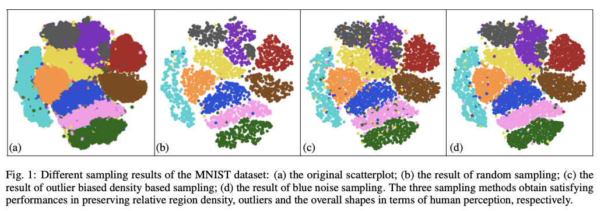

LibSampling
==========

A Library of  Sampling Methods for scatterplots



## Introduction

**LibSampling** is an implementation with python interfaces of sampling methods for scatterplots, including:

+ random sampling
+ density biased sampling
+ blue noise sampling
+ farthest point sampling
+ non-uniform sampling
+ SVD based sampling
+ hashmap based sampling
+ outlier biased random sampling
+ outlier biased blue noise sampling
+ outlier biased density based sampling
+ multi-class blue noise sampling
+ multi-view Z-order sampling
+ recursive subdivision based sampling.

Our goal is to help users to easily use those sampling methods. **LibSampling** provides a simple interface where users can easily apply it on their data, and we provide python sources. 

## Requirement

+ cffi==1.11.2
+ scipy==1.0.0
+ numpy==1.13.3+mkl
+ Flask==0.10.1
+ Werkzeug==0.14.1
+ matplotlib==2.1.1
+ scikit_learn==0.19.1

## Download LibSampling

You can be obtained **Libsampling** for the the current release (Version 1.0, April 2020) by directly cloning this repository. Please if you have any problems.

## Quick Start

A simple sample code for the usages of **LibSampling** is provided in `scripts/example_sampling.py`

```python
    import numpy as np
    from sampling.Sampler import *
    from sampling.SamplingMethods import *

    print("run Sampler.py")
    points = np.random.random((100, 2)) # Generated data, the input data should be a numpy array with the shape (n, 2)
    categories = np.random.random_integers(0, 1, 100) # Generated label, some sampling method would consider the label information as an reason to select or not select an item. It would be a np.zeros(n) as default.
    sampling_method = RandomSampling # You can choose your desired sampling method.

    sampler = Sampler()

    sampler.set_data(points, categories)
    args = {
        'sampling_rate': 0.5 # You can set the sampling ratio and other specific params for different sampling methods here.
    }

    sampler.set_sampling_method(sampling_method, **args)

    sampled_point, sampled_category = sampler.get_samples()

    print(sampled_point, sampled_category)
```


