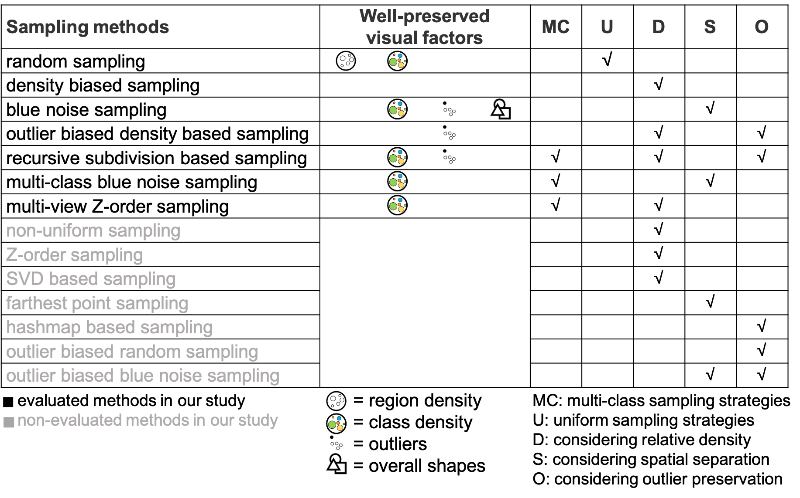

LibSampling
==========

##### A Library of  Sampling Methods for 2D Scatterplots


## Introduction

**LibSampling** is a python-based library of sampling methods for 2D scatterplots, which includes:

+ random sampling
+ density biased sampling [1] 
+ blue noise sampling [2] 
+ farthest point sampling [3] 
+ non-uniform sampling [4] 
+ Z-order sampling [5] 
+ SVD based sampling [6] 
+ hashmap based sampling [7] 
+ outlier biased random sampling [8] 
+ outlier biased blue noise sampling [9] 
+ outlier biased density based sampling [9] 
+ multi-class blue noise sampling [10] 
+ multi-view Z-order sampling [5] 
+ recursive subdivision based sampling [12] 

Our goal is to facilitate the use of the popular sampling methods in visualization, graphics, and data mining. **LibSampling** provides a simple python interface where users can easily apply an appropriate sampling method to their data. The characteristics of the sampling methods and the evaluation results of our study are listed as follows:



## Requirement

+ cffi==1.11.2
+ scipy==1.0.0
+ numpy==1.13.3+mkl
+ Flask==0.10.1
+ Werkzeug==0.14.1
+ matplotlib==2.1.1
+ scikit_learn==0.19.1

## Download LibSampling

The current release (Version 1.0, April 2020)  of **LibSampling** can be obtained by directly cloning this repository.


## Quick Start

Below is the example code to call a sampling method, where n​ and m are the sizes of the input and output data (sampling result), respectively.

```python
from sampling.Sampler import *
from sampling.SamplingMethods import *
sampler = Sampler() # Initialize the Sampler object
sampler.set_data(data, labels)
# data: an (n*2) numpy array indicating the point coordinates
# labels: an (n*1) numpy array indicating the class labels with intergers 0, 1, 2, ...
# or None if you use single-class sampling methods
sampler.set_sampling_method(RandomSampling, sampling_rate=0.5)
indices = sampler.get_samples_idx()
# indices: an (m*1) numpy array indicating the indices of the sampling result
sampled_data, sampled_labels = sampler.get_samples()
# sampled_data: an (m*2) numpy array indicating the sampled point coordinates
# sampled_labels: an (m*2) numpy array indicating the class labels of the sampled points
```

A more complete example of how to use **LibSampling** is provided in `example_sampling.py` :

```python
import numpy as np
from sampling.Sampler import *
from sampling.SamplingMethods import *

print("run Sampler.py")
points = np.random.random((10000, 2)) # Generated data, the input data should be a numpy array with the shape (n, 2)
categories = np.random.randint(0, 10, 10000) # Generated label, multi-class sampling method would consider the label information as an reason to select or not select an item. It would be a np.zeros(n) as default.

sampler = Sampler()

sampler.set_data(points, categories) # For single-class sampling methods like random sampling, categories is not needed to be provided
sampling_method = RandomSampling # You can choose your desired sampling method.
rs_args = {
    'sampling_rate': 0.3 # You can set the sampling ratio and other specific params for different sampling methods here.
}

sampler.set_sampling_method(sampling_method, **rs_args) # Set Random Sampling for the sampler with necessary params
sampled_point, sampled_category = sampler.get_samples() # Get the sampling result

print("Random sampling result:")
print(sampled_point, sampled_category)

sampling_method = OutlierBiasedRandomSampling
outlier_score = np.sum(np.abs(points - 0.5), axis=1)
obrs_args = {
    'sampling_rate': 0.5, # You can set the specific params for different sampling methods here, e.g., sampling rate
    'outlier_score': outlier_score # The default outlier_score will be determined by the class purity if you do not pass your own outlier_score to outlier biased sampling methods
}

sampler.set_sampling_method(sampling_method, **obrs_args) # Set Outlier Biased Random Sampling for the sampler with necessary params
sampled_point, sampled_category = sampler.get_samples() # Get the sampling result

print("Outlier biased random sampling result:")
print(sampled_point, sampled_category)

sampling_method = RecursiveSubdivisionBasedSampling
rsbs_args = { # This sampling method do not need sampling rate as input
	'canvas_width': 1600,
	'canvas_height': 900,
	'grid_width': 20,
	'threshold': 0.02,
	'occupied_space_ratio': 0.02,
	'backtracking_depth': 4
}
sampler.set_sampling_method(sampling_method, **rsbs_args)
sampled_point, sampled_category = sampler.get_samples() # Get the sampling result

print("Recursive subdivision based sampling result:")
print(sampled_point, sampled_category)
```

## References

[1] C. R. Palmer and C. Faloutsos. Density biased sampling: An improved method for data mining and clustering. In *Proceedings of the ACM SIG- MOD International Conference on Management of Data*, pages 82–92, 2000.

[2] R. L. Cook. Stochastic sampling in computer graphics. ACM Trans. Graph., 5(1):51–72, 1986.

[3] M. Berger, K. McDonough, and L. M. Seversky. cite2vec: Citation- driven document exploration via word embeddings. IEEE transactions on visualization and computer graphics, 23(1):691–700, 2016.

[4] E.BertiniandG.Santucci.Bychanceisnotenough:preservingrelative density through nonuniform sampling. In Proceedings of the Eighth International Conference on Information Visualisation, pages 622–629. IEEE, 2004.

[5] R.Hu,T.Sha,O.VanKaick,O.Deussen,andH.Huang.Datasampling in multi-view and multi-class scatterplots via set cover optimization. IEEE Transactions on Visualization and Computer Graphics, 26(1):739–748,
2020.

[6] P.Joia,F.Petronetto,andL.Nonato.Uncoveringrepresentativegroupsin multidimensional projections. Computer Graphics Forum, 34(3):281–290, 2015.

[7] S.Cheng,W.Xu,andK.Mueller.ColorMapND:Adata-drivenapproach and tool for mapping multivariate data to color. IEEE Transactions on Visualization and Computer Graphics, 25(2):1361–1377, 2019.

[8] S. Liu, J. Xiao, J. Liu, X. Wang, J. Wu, and J. Zhu. Visual diagnosis of tree boosting methods. IEEE transactions on visualization and computer graphics, 24(1):163–173, 2017.

[9] S.Xiang,X.Ye,J.Xia,J.Wu,Y.Chen,andS.Liu.Interactivecorrection
of mislabeled training data. In Proceedings of the IEEE Conference on
Visual Analytics Science and Technology, pages 57–68, 2019.

[10] L.-Y.Wei.Multi-classbluenoisesampling.*ACMTransactionsonGraph- ics*, 29(4):79, 2010.

[11] X. Chen, T. Ge, J. Zhang, B. Chen, C. Fu, O. Deussen, and Y. Wang. A recursive subdivision technique for sampling multi-class scatterplots. IEEE Transactions on Visualization and Computer Graphics, 26(1):729– 738, 2020.
